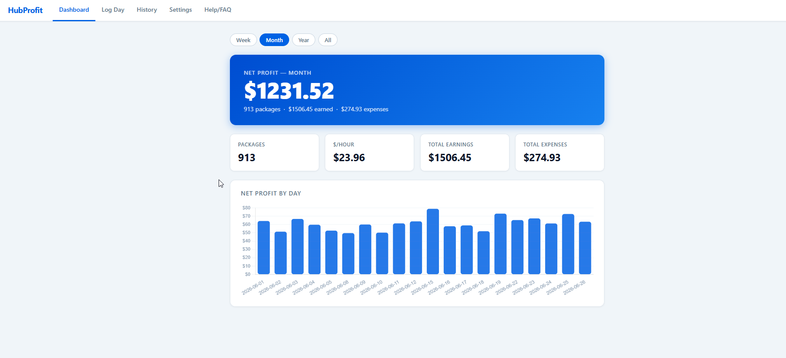
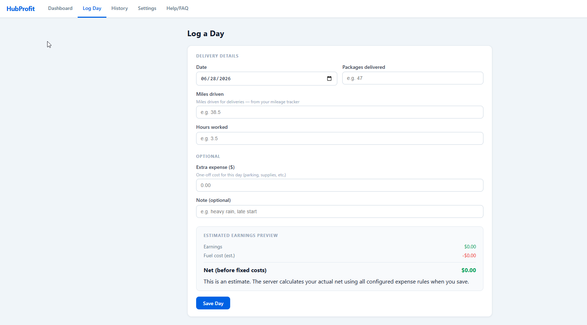
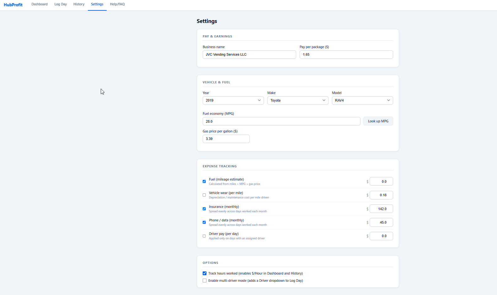
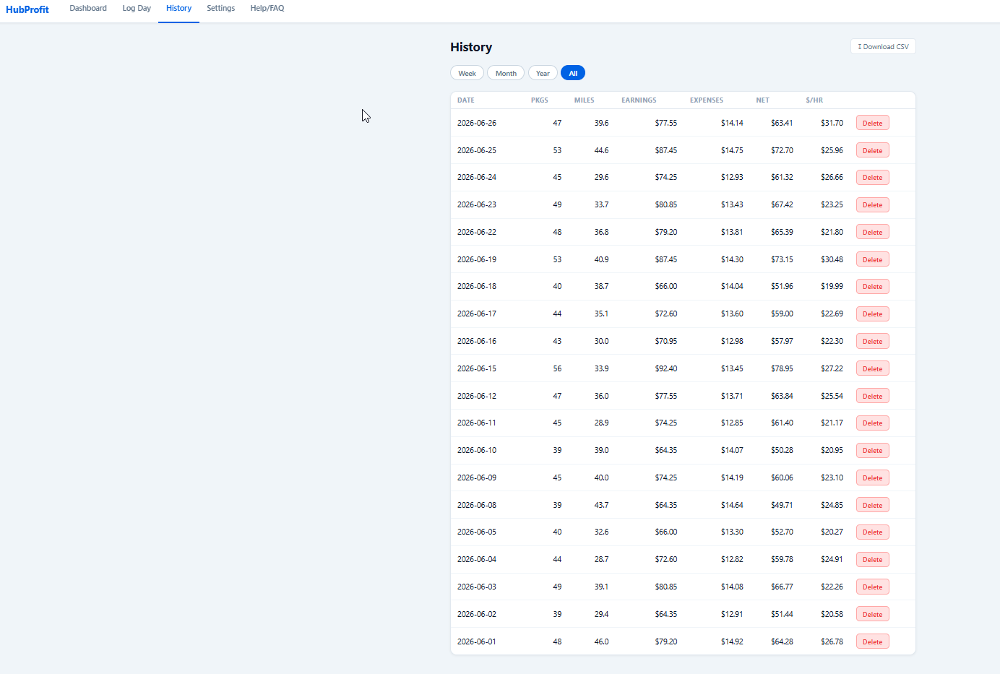

# HubProfit

A **free, self-hosted dashboard** that tracks the *real* net profit of your Amazon Hub Delivery business — your earnings minus fuel, insurance, and the other costs Amazon doesn't pay for.

> **You do not need to be a programmer to run this.** If you can install an app and copy/paste one line, you can run HubProfit. The step-by-step guide below walks you through everything.

---

## What it does

- Logs each day's **packages delivered** and **miles driven**
- **Edit any logged day** — fix a typo or a wrong date without deleting and re-entering it
- **Auto-estimates your fuel cost** from your vehicle's MPG (pulled free from the U.S. EPA database) and your gas price — no receipts to dig through
- Spreads **fixed monthly costs** (insurance, phone, etc.) across the days you actually work
- Shows **net profit** by day, week, month, and year — with a chart
- Optional **$/hour** so you know your true hourly rate
- **CSV export** for taxes and record-keeping
- **Your rates are frozen in history** — change your pay-per-package later and past days stay correct
- **100% private** — everything runs on your own computer. No account, no cloud, no tracking.

---

## Screenshots

**Dashboard** — your net profit at a glance, with a daily chart:



**Log Day** — quick daily entry with a live earnings & fuel estimate:



**Settings** — set your rate, pick your vehicle (MPG auto-fills), and toggle the expenses you want counted:



**History** — every day with net profit and $/hour, plus one-click CSV export:



---

## 🟢 Easy Install (Windows or Mac) — ~10 minutes

This is the recommended path for most people. You'll install one free program (Docker), download HubProfit, and run one command. That's it.

### Step 1 — Install Docker Desktop (free)

Docker is the free tool that runs HubProfit for you so you don't have to install anything technical.

1. Go to **https://www.docker.com/products/docker-desktop/**
2. Download **Docker Desktop** for your computer (Windows or Mac) and run the installer — just click through the prompts.
3. **Open Docker Desktop after installing** and leave it running (you'll see a little whale icon 🐳 in your taskbar/menu bar). HubProfit needs Docker to be running.

> First time opening Docker Desktop, it may ask you to accept terms and take a minute to start. Wait until it says **"Engine running."**

### Step 2 — Download HubProfit

1. On the HubProfit GitHub page, click the green **`<> Code`** button, then **Download ZIP**.
2. **Unzip** the downloaded file. You'll get a folder named something like `hub-profit-main`.
3. Remember where it is (e.g., your Downloads or Desktop).

### Step 3 — Open a terminal in that folder

You'll paste one command here. Don't worry — this is the only "techy" step.

- **Windows:** Open the unzipped folder, then **right-click an empty area inside it** and choose **"Open in Terminal"** (on older Windows, hold **Shift** + right-click → "Open PowerShell window here").
- **Mac:** Right-click the folder → **Services** → **"New Terminal at Folder"**. (If you don't see it, open the **Terminal** app, type `cd ` with a space, then drag the folder onto the window and press Enter.)

### Step 4 — Start HubProfit

Paste this line into the terminal and press **Enter**:

```bash
docker compose up -d
```

The first time, it will download and build for a minute or two. When it finishes, HubProfit is running.

### Step 5 — Open it

Open your web browser and go to:

### 👉 http://localhost:8000

Go to the **Settings** tab first and:
1. Enter your **pay-per-package** rate (the default is $1.65).
2. Pick your **vehicle** — the MPG fills in automatically.
3. Set your **gas price**, and turn on the **expenses** you want counted (insurance, phone, etc.).

Then start logging your days under **Log Day**. 🎉

### Stopping and starting

- **Stop it:** in the same folder's terminal, run `docker compose stop`
- **Start it again later:** `docker compose start` (or `docker compose up -d`)
- Your data is saved between restarts — see [Your data](#your-data).

---

## 🔧 Advanced Install (Linux server / homelab / Portainer)

If you run a home server, the same single container deploys cleanly.

```bash
git clone https://github.com/victorca0412-dev/hub-profit.git
cd hub-profit
docker compose up -d
```

- Reach it from another device on your network at **http://SERVER-IP:8000** (e.g., `http://192.168.0.50:8000`).
- **Change the port** without editing files: set the `HOST_PORT` environment variable (defaults to `8000`). e.g. `HOST_PORT=8412 docker compose up -d` → browse at `http://SERVER-IP:8412`.
- Data is stored in the named volume **`hubprofit_data`** — don't delete it on redeploys.

### Deploying with Portainer (Git stack)

1. In Portainer, go to **Stacks → + Add stack** and name it `hubprofit`.
2. **Build method:** choose **Repository**. (Not "Web editor" — this app builds its own image from the Dockerfile, which needs the repo files.)
3. **Repository URL:** `https://github.com/victorca0412-dev/hub-profit`
4. **Repository reference:** `refs/heads/master`
   ⚠️ Portainer defaults this to `main` — you **must** change it to `master`, or the deploy will fail.
5. **Compose path:** `docker-compose.yml`
6. **Authentication:** leave **off** (the repo is public).
7. **Environment variables** → **+ Add an environment variable:**
   - name: `HOST_PORT`  ·  value: your chosen port, e.g. `8412` (skip this to use the default `8000`).
8. Click **Deploy the stack.** The first deploy builds the image from the Dockerfile and takes a minute or two. When it's up, browse to `http://SERVER-IP:<port>` (e.g. `http://192.168.0.50:8412`) and open the **Settings** tab first to set your rate, vehicle, and expenses.

**Updating in Portainer:** open the stack → **Pull and redeploy** (rebuilds from the latest `master`). You can also enable the stack's **Automatic updates** for hands-off GitOps.

> On redeploy or removal, **never enable "Remove volumes"** or you'll lose your logged days (they live in the `hubprofit_data` volume).

---

## Updating

When a new version is out, get the latest and rebuild:

- **Easy install (ZIP):** download the new ZIP, unzip it over/next to the old folder, open a terminal there, and run `docker compose up -d --build`.
- **Advanced install (git):**

```bash
git pull && docker compose up -d --build
```

Your logged data is **not** affected by updates (it lives in the Docker volume, not the code folder).

---

## Your data

All your data stays in a local Docker volume named **`hubprofit_data`** on your own machine. Nothing is ever sent anywhere — no accounts, no cloud, no tracking.

> **⚠️ Don't delete your data by accident.** When recreating or redeploying the container, do **not** remove the `hubprofit_data` volume, or you'll lose your logged days. In **Portainer, never check "Remove volumes"** on redeploy.

To make a backup, copy the volume's contents (advanced users), or simply use **History → Download CSV** regularly to keep an exported copy.

---

## Troubleshooting

**"Cannot connect" / the page won't load at http://localhost:8000**
- Make sure **Docker Desktop is open and running** (whale icon 🐳, "Engine running").
- Give it a few seconds after `docker compose up -d`, then refresh.
- Confirm it's running: in the folder's terminal, run `docker compose ps` — you should see `hubprofit` listed.

**"port is already allocated" / port 8000 in use**
- Something else is using port 8000. Open `docker-compose.yml`, change the line `- "8000:8000"` to `- "8090:8000"`, save, run `docker compose up -d` again, and open **http://localhost:8090** instead.

**`docker: command not found` or `docker compose` doesn't work**
- Docker Desktop isn't installed or isn't running. Revisit **Step 1**, and make sure you opened Docker Desktop after installing.

**The vehicle MPG lookup says "unavailable"**
- The free EPA database may be temporarily down. You can type your MPG in manually in Settings and continue — it doesn't block anything.

**I want to start completely fresh**
- `docker compose down -v` removes the container **and its data volume** (this erases your logged days — export a CSV first if you want to keep them).

---

## For developers

Run it locally without Docker:

```bash
# Create and activate a virtual environment
python -m venv .venv
.venv\Scripts\activate        # Windows
# source .venv/bin/activate   # macOS / Linux

# Install dependencies
pip install -r requirements.txt

# Start the development server (auto-reloads on changes)
uvicorn app.main:app --reload
```

Open **http://localhost:8000**. Run the tests with:

```bash
pytest
```

All 44 tests should pass.

---

## License

MIT — see [LICENSE](LICENSE). Free to use, modify, and share.

---

## Disclaimer

Not affiliated with or endorsed by Amazon. "Amazon Hub" is a trademark of Amazon.com, Inc.
